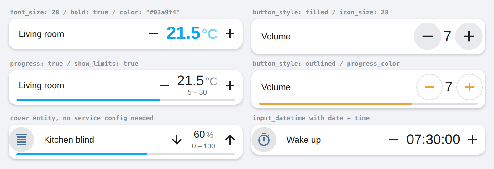

# numberbox-card

NumberBox for input sliders and number entities

Inspired from [simple thermostat](https://github.com/nervetattoo/simple-thermostat)

## Installation

Manually add numberbox-card.js
to your `<config>/www/` folder and add the following to the `configuration.yaml` file:
```yaml
lovelace:
  resources:
    - url: /local/numberbox-card.js?v=1
      type: module
```

_OR_ install using [HACS](https://hacs.xyz/) and add this (if in YAML mode):
```yaml
lovelace:
  resources:
    - url: /hacsfiles/numberbox-card/numberbox-card.js
      type: module
```

The above configuration can be managed directly in the Configuration -> Lovelace Dashboards -> Resources panel when not using YAML mode,
or added by clicking the "Add to lovelace" button on the HACS dashboard after installing the plugin.


## Configuration

| Name | Type | Default | Description
| ---- | ---- | ------- | -----------
| type | string | **Required** | `custom:numberbox-card`
| entity | string | **Required** | `input_number.my_slider` or `number.my_number`
| name | string/bool | `friendly_name` | Override friendly name (set to `false` to hide)
| picture | string/bool | `entity_picture` | picture as icon eg. `/local/picture.png` local is www folder (picture has priority over icon so set to `false` to hide / display icon instead) 
| icon | string/bool | `icon` | Override icon (set to `false` to hide)
| border | bool | `false` | set to `true` to show borders
| icon_plus | string | `mdi:plus` | custom icon
| icon_minus | string | `mdi:minus` | custom icon
| initial | number | `?` | initial value when `unknown` or `unavailable` state
| delay | number | `1000` | delay after pressing in ms, `0` to disable
| speed | number | `0` | long press speed in ms, `0` to disable
| refresh | number | `0` | `1` to disable debounce when change, may fix issues with updating
| secondary_info | string |  | `last_changed` `last_updated` or any text/html,<br />you can also display states or other attributes of any entity for eg. <br /> `Light is %light.office_1:state` <br />`Room temp is %climate.heating:attributes:current_temperature:~1` (:~x digits after decimal) <br />`%switch.switch_2:last_updated`
| unit | string/bool  | `unit_of_measurement` | Override unit string (set to `false` to hide) <br />`time` to display the number in hh:mm:ss<br />`timehm` to display the number in hh:mm<br />to use javascript on state value use brackets to eval for eg. `(value*100)` to change the display value

## Display options

Everything below is optional and works without `card-mod`.



| Name | Type | Default | Description
| ---- | ---- | ------- | -----------
| font_size | number/string | theme | value font size, `26` is read as `26px`, strings pass through (`1.8em`)
| bold | bool | `false` | bold value
| font_weight | number/string |  | full control over the weight, wins over `bold`
| color | string | theme | value color, eg `green`, `#ff9800`, `var(--primary-color)`
| pending_color | string | `#f00` | color of the value while the change is waiting for `delay` to pass
| icon_size | number | `24` | size of the plus/minus icons in px
| icon_color | string | theme | color of the plus/minus icons
| button_style | string |  | `outlined`, `filled` or `square` to give the buttons a shape
| button_color | string | theme | background of `filled` buttons
| align | string | `center` | `left`, `center` or `right`, for cards without a name
| progress | bool | `false` | thin progress bar showing the value between `min` and `max`
| progress_color | string | theme | color of the progress bar
| show_limits | bool | `false` | small `min – max` line under the value
| edit | bool | `false` | tap the value to type it in directly, `Enter` or leaving the field saves it, `Esc` cancels. The name/icon still opens more-info
| haptic | bool/string | `false` | haptic feedback on the companion app, `true` is `light`, or name one of `success` `warning` `failure` `light` `medium` `heavy` `selection`

```yaml
type: custom:numberbox-card
entity: input_number.my_slider
border: true
font_size: 28
bold: true
color: '#03a9f4'
button_style: filled
icon_size: 28
progress: true
show_limits: true
edit: true
haptic: true
```

The plus (or minus) button dims automatically when another step would leave the
`min`/`max` range, the buttons have hover/press/keyboard-focus states and the
`aria-label`s tell a screen reader which entity and step it is about.

### CSS variables

The same values can be set in a theme or with `card-mod`, so one theme can style
every numberbox at once:

`--numberbox-font-size` `--numberbox-line-height` `--numberbox-font-weight`
`--numberbox-color` `--numberbox-pending-color` `--numberbox-unit-size`
`--numberbox-unit-opacity` `--numberbox-icon-size` `--numberbox-icon-color`
`--numberbox-button-color` `--numberbox-hover-color`
`--numberbox-progress-color` `--numberbox-progress-track` `--numberbox-progress-height`

## Entity presets

These domains work with just an `entity`, the service/param/state/min/max/step
below are filled in for you and any of them can still be overridden:

| Domain | service | param | state | min | max | step
| ------ | ------- | ----- | ----- | --- | --- | ----
| `input_number` `number` | `<domain>.set_value` | `value` | state | attribute | attribute | attribute
| `cover` | `cover.set_cover_position` | `position` | `current_position` | 0 | 100 | 10
| `fan` | `fan.set_percentage` | `percentage` | `percentage` | 0 | 100 | 10
| `light` | `light.turn_on` | `brightness` | `brightness` | 0 | 255 | 25
| `media_player` | `media_player.volume_set` | `volume_level` | `volume_level` | 0 | 1 | 0.05
| `climate` | `climate.set_temperature` | `temperature` | `temperature` | `min_temp` | `max_temp` | `target_temp_step`
| `input_datetime` | `input_datetime.set_datetime` | `time` | state | 0 | 86340 | 60
| `timer` | `timer.start` | `duration` | `duration` | 0 | 86340 | 60

```yaml
type: custom:numberbox-card
entity: cover.kitchen_blind
border: true
progress: true
```

`input_datetime` helpers that have **both** a date and a time are supported too:
the card edits the time part and sends `datetime` with the existing date, so the
date is not lost.

> `timer` note: `timer.start` only overrides the duration of the current run.
> Home Assistant restores the helper's configured duration once the timer
> finishes, so the card cannot make a new duration permanent. Point the card at
> an `input_number` and start the timer from an automation if you need that.

#### Advanced Config for climate/fan/input_datetime etc


| Name | Type | Default | Description
| ---- | ---- | ------- | -----------
| state | string | `undefined` | set it for attribute display
| min | number | attribute `min` |  
| max | number | attribute `max`  |  
| step | number | attribute `step`  |  
| min_entity | string | | eg `sensor.my_min_size`  |  
| max_entity | string | | eg `sensor.my_max_size`  |  
| step_entity | string | | eg `sensor.my_step_size`  |
| toggle_entity | string | | eg `switch.heating` to display a toggle switch |
| service | string | `input_number.set_value` |  service name
| param | string | `value` |  service parameter
| service_params | object | `{entity_id: entity, [param]: changedvalue}` |  additional service params
| moreinfo | string | entity | More info entity eg `sensor.my_max_size`, to navigate eg `/lovelace/mytab`,  `false` to disable  |  

```
type: entities
entities:
  - type: custom:numberbox-card
    entity: climate.heating
    icon: mdi:fire
    state: temperature
    service: climate.set_temperature
    param: temperature
    service_params:
      entity_id: climate.heating
      hvac_mode: heat
    min: 0
    max: 30
    step: 0.5
    speed: 500

type: entities
entities:
  - type: custom:numberbox-card
    entity: fan.smartfan_fan
    icon: mdi:fan
    state: percentage
    service: fan.set_percentage
    param: percentage
    min: 0
    max: 100
    step: 20

type: entities
entities:
  - type: custom:numberbox-card
    entity: input_datetime.timer_time
    service: input_datetime.set_datetime
    param: time
    unit: time
    step: 60


# Timer duration change
type: entities
entities:
  - type: custom:numberbox-card
    entity: timer.heating
    icon: mdi:fire
    service: timer.start
    param: duration
    state: duration
    min: 0
    max: 999999
    step: 60
    unit: time
```


```
type: entities
entities:
  - type: custom:numberbox-card
    entity: climate.downstairs_heating
    icon: mdi:fire
    service: climate.set_temperature
    param: temperature
    state: temperature
    min: 0
    max: 30
    step: 0.5
    toggle_entity: switch.downstairs_heater
    secondary_info: >
      Mode:<b style="color:red"> %climate.downstairs_heating:attributes:hvac_action </b><br />
      Current temp:<b style="color:green"> %climate.downstairs_heating:attributes:current_temperature </b>
      %switch.downstairs_power:last_changed
```


## Examples


Configurations:
```
type: entities
title: Example
show_header_toggle: false
entities:
  - entity: input_number.my_slider
    secondary_info: last-changed
  
  - entity: input_number.my_slider
    type: 'custom:numberbox-card'
    icon: 'mdi:timelapse'
    secondary_info: last-changed
    unit: S

  - entity: input_number.my_slider
    type: 'custom:numberbox-card'
    unit: time

  - entity: input_number.my_slider
    type: 'custom:numberbox-card'
    icon_plus: 'mdi:chevron-up'
    icon_minus: 'mdi:chevron-down'
    card_mod:
      style: |
        .cur-num{font-size:25px !important}
        .cur-num.upd{color:green}
        .cur-unit{color:orange; font-size:100% !important; opacity:1 !important}
        .grid-left{color:red}
        .grid-right{color:blue}
        .cur-box ha-icon{transform:scale(2)}
card_mod:
  style: |
    #states{padding:8px 10px !important}
```

```yaml
- type: custom:numberbox-card
  entity: input_number.my_slider
  name: My Title
  icon: 'mdi:fire'
  border: true
  card_mod:
    style: |
      ha-card .cur-num {
         color: green;
       }  
```

 

```yaml
type: horizontal-stack
cards:
  - type: custom:numberbox-card
    border: true
    entity: number.office_temp
    name: false
    card_mod:
        style: >
          .body{display:block!important}
          .body::after{text-align:center;font-size:10px;content:"Temperature";display:block!important}
  - type: custom:numberbox-card
    border: true
    entity: number.office_timer
    unit: time
    name: false
    card_mod:
        style: >
          .body{display:block!important}
          .body::after{text-align:center;font-size:10px;content:"Minutes";display:block!important}
```


It is also possible to add this using `+ Add Card` UI and choose `Custom: Numberbox Card`

---

<a href="https://www.buymeacoffee.com/htmltiger" target="_blank"></a>
